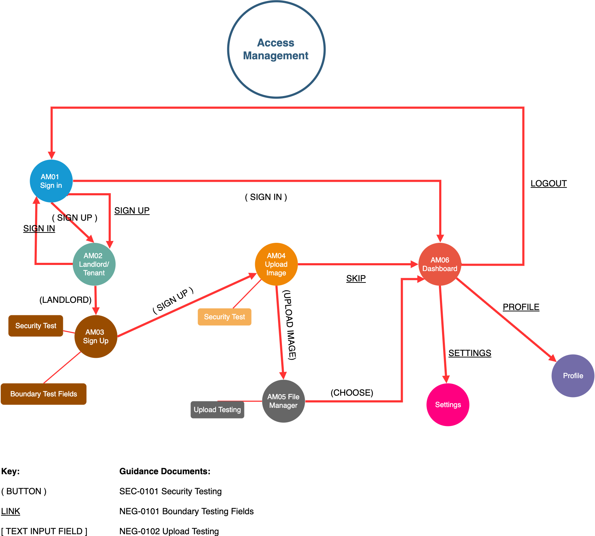

# 2019 in Software Test

At the end of the year, I like to look back at what new discoveries I've made and lessons I've learnt as a QA engineer. 2019 has proved to be a bonanza year, with some startling changes in direction for Test and with new technologies and methodologies making a break into the mainstream. There's been:

1. More progress with AI in tooling and reporting, with an exciting new library that allows you to build your own AI-powered Test Automation framework.

2. The revolutionary ability to control your Test Environment within your tests.

3. New Testing methodologies that I'd never encountered before this year (Layout Testing, Mutation Testing, new advances in Shift-Right Testing).

4. Surprise mergers and acquisitions.

5. RPAs suddenly became massively popular and then disappeared again, leaving some interesting open-source options.

And much much more.

I'll dive right in with an oft-overlooked area that surprised me the most.

## Exploratory Testing

One of the most underappreciated and difficult types of Testing is Exploratory Testing. It's incredibly hard to identify how much is too much or too little, and what the scope should be for each feature release, update or bug fix.  However, with the advent of Test Automation replacing Regression Testing, it's a discipline that Testers are starting to (rightfully) pay more time and attention to.

In the past, I've mapped user journeys through an application using Test Cases, and then used these as the bases for Exploratory and Negative Testing. But these are hard to maintain, and it is difficult to describe different flows without creating many Test Cases with duplicated steps.

Recently I came across this blog post by Alan Richardson ([the Evil Tester](https://www.eviltester.com/)) which describes how to [model the flow of user interactions through your application](https://www.eviltester.com/blog/eviltester/2019/08/14-path-modelling-for-testing-google-example/) for Exploratory Testing.

It's revolutionised my approach. For every new application I now test, I map the flow by hand (as described in the blog post). And once a full run-through is complete, I break the flows down into Feature areas and document them on [draw.io](https://www.draw.io/).

These have a very simple key. If I click on a button, it's marked in parentheses `()`, links are underlined and text boxes that trigger a change in the page are contained in square brackets `[]`.

Each new page is a node with a unique ID and notes on what Exploratory Tests to perform are linked to each node.

The paths are represented as arrows, which are initially red. When they've been tested, they're turned green.

[draw.io](https://www.draw.io/) allows you to save these diagrams to GitHub, making it easy to version them along with the code. I've included an example below.

You can find the XML for the diagram on my [GitHub](https://github.com/safebear/bunk-exploratory-testing/blob/master/access-management-user-flows.drawio).

As you can see, this makes it easy to quickly identify what areas of the application has changed with a new release and to scope accordingly. Any new flow will be added with red arrows until it's tested.

I have found this approach to be useful to me, but don't take it as gospel. Try drawing the Application Flows by hand first and find an approach that suits your Exploratory Testing style.

**Chrome Extensions**

There are also many Chrome extensions that are useful for Exploratory Testing. I've included a few below:

1. [Screencastify](https://www.screencastify.com) is useful for recording your Exploratory Testing session, just incase you forget what you've done to break the system.

2. [Bug Magnet](https://bugmagnet.org) is an oldie, but a goodie. It automates your negative testing of elements on the screen.

3. [CounterString](https://www.eviltester.com/page/tools/counterstringjs/) and [Useful Snippets](https://github.com/eviltester/usefuljssnippetextension) are both excellent offerings from the [Evil Tester](https://www.eviltester.com/) and well worth installing in your browser.

## Layout Testing

This is something that was new to me, but is becoming more and more important as PWAs (Progressive Web Apps) start to become the norm (Progressive Web Apps are websites that look and feel like an app when viewed on your mobile device).

If you want to look into this, I'd recommend the [Galen Framework](http://galenframework.com/) which can easily be plugged into your project and CI. 

If you want to practice using it, [GoThinkster](https://github.com/gothinkster/realworld) have the same real world web app designed in a huge variety of frameworks for you to play on. I really like [HNPWA](https://hnpwa.com/) also.

## Test Automation Frameworks

[Cypress.io](https://www.cypress.io/) is still the best Test Automation framework for Web Apps out there in terms of usability and design. But it still doesn't have cross-browser abilities, or the ability to jump domains, making it unusable for a lot of enterprise applications with users who don't use Chrome. I've also had a lot of issues trying to get it to work with TypeScript.

[TestCafe](https://github.com/DevExpress/testcafe) is still underrated and getting better with every release.

[Selenium](https://selenium.dev/documentation/en/) is still continuing its slow evolution to Selenium 4.0 and to hopefully a simpler and more stable application with enhanced logging capabilities. Some [user-friendly documentation](https://selenium.dev/documentation/en/) has even been produced, although clicking on arrows to scroll through the chapters like a presentation is infuriating for some.

[Appium](http://appium.io/) will also be evolving in the 2.0 version. No longer a bloated beast that installs everything you ever might need, the new version will be a modular, light-weight interface that can be tailoured to your needs.

[Test Project](https://testproject.io/) has become the first free, open-source, cloud automation framework and is worth a look because of this.

[WebDriverIO](https://webdriver.io/) stayed on the bleeding edge by becoming the first framework (that I know of) to include support for [querying the Shadow DOM](https://webdriver.io/blog/2019/02/22/shadow-dom-support.html) (now others, like [TestCafe](https://github.com/DevExpress/testcafe) can also do this). The framework also now allows you to use the [Chrome DevTools Protocol](https://chromedevtools.github.io/devtools-protocol/) to automate the browser (like [Puppeter](https://github.com/puppeteer/puppeteer)) instead of the WebDriver Protocol. It also now includes Visual Regression Testing, which is becoming a must for a lot of Test Frameworks.

### Wrappers for Test Frameworks

[Smashtest](https://smashtest.io/) is an interesting project for making human-readable automated test cases on top of Selenium. I see a lot of companies using Cucumber just for this reason. This may be a more suitable alternative.

[CodeceptJS](https://codecept.io/) I love the concept of this framework, although I've yet to use it in anger. Again, it is designed to make simple, human-readable automented tests, but the real genius lies in the plug-and-play aspect of the underlying Test Framework. This wrapper can sit above [Puppeteer](https://github.com/puppeteer/puppeteer), [WebDriver](https://selenium.dev/projects/), [Protractor](https://www.protractortest.org/#/), [Test Cafe](https://devexpress.github.io/testcafe/) etc, abstracting away all the complexity and allowing you to easily switch between frameworks if you decide that one isn't working for you. There's also `helpers` for [Appium](http://appium.io/) and [Detox](https://github.com/wix/Detox) for mobile testing, and for [ResembleJS](https://github.com/rsmbl/Resemble.js) for Visual Testing. This has the potential to become my go-to framework.

### Other News

[Applitools](https://applitools.com/) have been running a world-wide 'Rockstar' [Hackathon](https://applitools.com/hackathon) to prove once-and-for-all that Visual Testing is faster and more reliable than traditional Test Automation tools such as Selenium. Another one is scheduled for Q1 next year.

[Percy](https://percy.io/features) and [Ghost Inspector](https://ghostinspector.com/) are interesting competitors to Applitools that are worth a look.

### AI in Test Automation

[Appium](https://appiumpro.com/editions/39) are investigating AI in Test Automation with the folks at [Test.ai](https://www.test.ai/) although it's in early stages.

If you're brave enough to build your own Test Automation tool that incorporates AI, then [AGENT](https://github.com/ultimatesoftware/agent) is an open-source library that has done most of the groundwork for you. It's certainly worth a look.

### RPAs

For those who are interested in RPAs, [UI Vision](https://ui.vision/) (previously Kantu) and [Automagica](https://github.com/OakwoodAI/Automagica) are interesting open-source options. Especially as UI Vision supports OCR (Optical Character Recognition).

## Performance Testing

[K6](https://github.com/loadimpact/k6) is still, in my opinion, the easiest and best tool to use for integrating performance testing into your project and CI. JMeter is powerful, but still feels awkward, dated and inaccessable to other members of the SCRUM team.

## API Testing

[Postman](https://www.getpostman.com/api-visualizer) have released an new tool called the `API Visualizer` to visually map the data you get from your API in any graph format you can think of. 

[IBM](https://www.ibm.com/uk-en/cloud/api-connect/api-test) Have released a free(ish) cloud API testing tool with the snappy name of `API Connect test and monitor`. It feels a little over-engineered, while light on features compared to Postman.

## Microservices

[Pact](https://docs.pact.io/) is still pretty much the leader of the pack when it comes to `Consumer-Driven Contract Testing`. However be aware that every implementation comes with a maintenance overhead. [HLTech](https://github.com/HLTech/judge-d) have created a wrapper called [Judge Dredd](https://github.com/HLTech/judge-d) that may help counter this issue.

[Spring Cloud Contract](https://spring.io/projects/spring-cloud-contract) is also worth a look. It has fantastic documentation, but not all the functionality of PACT just yet.

## Test Data

[Faker](https://github.com/marak/Faker.js/) is still the king at generating useable and unique test data for all your Test Automation needs. I've linked to the JS version here, but it's been ported to most languages.

## Test Environments

[Test Containers](https://www.testcontainers.org/) is one of the biggest revolutions in Test Environments to come out of 2019. It enables you to manage your dockerized test environments from within your test. Allowing you to only bring up applications or environments as and when they're needed. Hugely useful for integration testing. It has also been ported to multiple languages.

## Reporting

[ReportPortal](https://reportportal.io/) is the king of all Test Automation reporting (and open-source). You do need to host it yourself (there's a decent guide here for [hosting it in the cloud](https://github.com/reportportal/kubernetes/tree/master/reportportal/v5)), but it's definitely worth the effort.

## BDD

[Cucumber for Jira](https://marketplace.atlassian.com/apps/1221264/cucumber-for-jira) is the first product launch after Cucumber was aquired by [Smartbear](https://smartbear.com/). Finally companies can sync their Feature Files with their Jira tickets if they wish.

## Learning

The [Test Automation University](https://testautomationu.applitools.com/) was launched by [Applitools](https://applitools.com/). There are some great courses on there, but you might need to dig around a bit to find them.

## Unit Testing

[Mutation Testing](https://stryker-mutator.io/) has become a 'must have' for all dev teams out there. It's truely a wonderful way to discover how robust your Unit Test framework, and your code, really is.

[Snapshot Testing](https://jestjs.io/docs/en/snapshot-testing) was introduced by [Jest](https://jestjs.io/) and is also becoming essential as the UX and design of the website becomes all important. For some companies it's the only way a user will engage with their product.

## New Methodologies

'Shift-left Testing' and 'TDD' have been around for a while now, but this year, there's been more focus on what application testing is being performed in the DevOps and live arenas. Called 'Shift-Right Testing', these encompass a wide range of techniques that have increased in popularity now that Serverless and Cloud technologies make them viable. I've summarised a few below. Some you may recognise, some are relatively new.

**Code Instrumentation:** The developers include code in the app to test the performance of the live application. I.e. For Debugging (Code Logic), Tracing (Code Exec) and writing to Performance counters and Event logs.

**Real User Monitoring:** A type of Performance monitoring that captures and analyzes each transaction by users of a website or application. Key metrics like load time and transaction paths. For example:

1. A developer might notice that during prime time, traffic spikes cause an increase in timeouts, resulting in frustrated customers and lower Google rankings.
2. An end-user portal like a bank software system may use it to spot intermittent issues, like login failures that only occur under specific, rare conditions.
3. An app developer may use it to highlight failures in different platforms that don’t show up during pre-deployment testing.

**Synthetic User Monitoring:** A form of active web monitoring that involves deploying behavioral scripts in a web browser to simulate the path a customer or end-user takes through a website (similar to Test Automation 'happy paths'). This is used as a transaction test for benchmarking your application before launch, comparing releases and comparing performance against competitors

**Dark Launching:** Is the process of releasing production-ready features to a subset of your users prior to a full release. This enables you to decouple deployment from release, get real user feedback, test for bugs, and assess infrastructure performance.

**Alpha/Beta Testing:** Lets early adopters find the bugs that are important to them.

**Injecting Chaos** The Chaos Monkey principle. Systematically break (and restore) aspects of the live environment and ensure that the failure was caught by your monitoring and recovery systems.

**Dogfooding:** When an organization uses its own product. This can be a way for an organization to test its products in real-world usage before the launch of a new release.

**Feature Flags:** Features are pushed live instantaneously, but can be switched on and off. Also called Feature Toggle. Available in Code Control software such as Git.

## Summary

I hope you enjoyed this yearly roundup. I've tried to focus on open-source projects where possible, in order to promote the good work that they're doing. however that's not to say that there isn't many useful commercial tools out there. I also don't claim to have the authoratitive list. If I missed anything, please don't hesitate to add comments below.